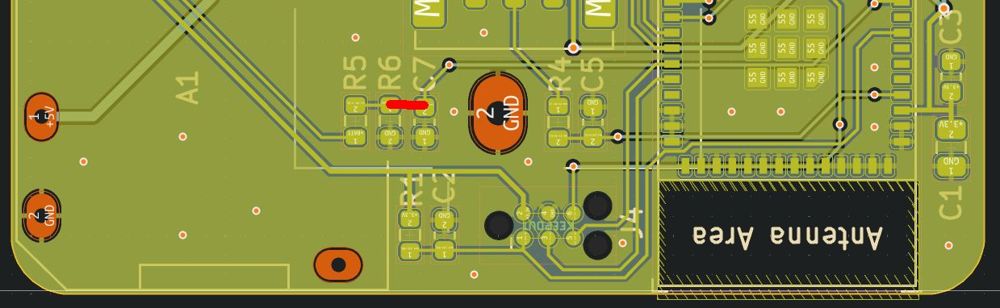

# Module `v_bat`

- The battery voltage of FiZZy can be monitored via `GPI35`, which refers to `ADC1_CHANNEL_7`
- Because of the voltage divider, the measured voltage needs to be multiplied by 2
- The ESP32 has some [linearity issues](https://github.com/e-tinkers/esp32-adc-calibrate?tab=readme-ov-file). For compensation, the ESP-IDF calibration is used.

**NOTE:** PCB version C needs a soldering bridge between C7 and R6:
